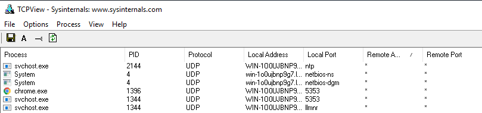

# end point security intro
## sysinternals 
sysinternals is the cluster of miltilpe tools which is used over the multiple domains like :-
- File and Disk Utilities
- Networking Utilities
- Process Utilities
- Security Utilities
- System Information
- Miscellaneous
  
**and the most used among them are :-**
- TCPView - Networking Utility tool.
- Process Explorer - Process Utility tool.
## TCPVIEW
TCPView is a Windows program that will show you detailed listings of all TCP and UDP endpoints on your system, including the local and remote addresses and state of TCP connection
on some software like Windows Server 2008, Vista, and XP tcpview reports the process that owns end points 
tcpview is know for the more infromative and convinently presented subset of the netstat program that ships with windows 

*note :- the tcpview comes with cli version of it known as tcpvcon


source:tryhackme
As shown above, every connection initiated by a process is listed by the tool, which may aid in correlating the network events executed concurrently.

## **PROCESS EXPLORER**
the process explorer comes with the two windows the top one shows
1. the process running
2. the accounts owning that proceeses

the bottom window shows the active mode of the process explorer
****

# 	ENDPOINT LOGGING AND MONITORING
endpoint logging, enables us to audit significant events across different endpoints, collect and aggregate them for searching capabilities, and better automate the detection of anomalies.
## windows event log
the windows event log are not the regular files that can be viewed in the text editor , they are stored in the propriatery binary software with .ent or .evtx extension and they are typically stored in the 
`C:\Windows\System32\winevt\Logs`
the three ways to view logs are :-
1. Event Viewer (GUI-based application)
2. Wevtutil.exe (command-line tool)
3. Get-WinEvent (PowerShell cmdlet)
## sysmon
Sysmon (stands for system monitor) , a tool used to monitor and log events on Windows, is commonly used by enterprises as part of their monitoring and logging solutions. As part of the Windows Sysinternals package, Sysmon is similar to Windows Event Logs with further detail and granular control.

it is commonly used with a security information and event management (SIEM) system or other log parsing solutions that aggregate, filter, and visualize events. 
Lastly, Sysmon includes 27 types of Event IDs, all of which can be used within the required configuration file to specify how the events should be handled and analyzed. 
An excellent example of a configuration file auditing different Event IDs created by SwiftOnSecurity is linked here [](https://github.com/SwiftOnSecurity/sysmon-config)

## OSQUERY
Osquery is an open-source tool created by Facebook. With Osquery, Security Analysts, Incident Responders, and Threat Hunters can query an endpoint (or multiple endpoints) using SQL syntax. Osquery can be installed on various platforms: Windows, Linux, macOS, and FreeBSD.

To interact with the Osquery interactive console/shell, open CMD (or PowerShell) and run osqueryi. You'll know that you've successfully entered into the interactive shell by the new command prompt.
buy using the software Kolide Fleet  use can filter the multiple end points at the same time .
```
osquery> select pid,name,path from processes where name='lsass.exe';
+-----+-----------+-------------------------------+
| pid | name      | path                          |
+-----+-----------+-------------------------------+
| 748 | lsass.exe | C:\Windows\System32\lsass.exe |
+-----+-----------+-------------------------------+
osquery> 
```

## WAZUH 
Wazuh is an open-source, freely available, and extensive EDR (endpoint detection response ) solution, which Security Engineers can deploy in all scales of environments.
wazuh operater on managment agent model it magment is installed on the single device and the agent is installed on the devices you would like to monitor

let's briefly run through what an EDR is. Endpoint detection and response (EDR) are tools and applications that monitor devices for an activity that could indicate a threat or security breach. These tools and applications have features that include:

- Auditing a device for common vulnerabilities
- Proactively monitoring a device for suspicious activity such as unauthorized logins, brute-force attacks, or privilege escalations.
- Visualizing complex data and events into neat and trendy graphs
- Recording a device's normal operating behaviour to help with detecting anomalies

## BASELINING

Baselining is the process of knowing what is expected to be normal. In terms of endpoint security monitoring,
****
