# sysinternals
we have already had th eintro of the sysinternals in the previous file check that for if you have forgotten
let let dive into it ,we will start with first tool 

## Sigcheck
"Sigcheck is a command-line utility that shows file version number, timestamp information, and digital signature details, including certificate chains. It also includes an option to check a file’s status on VirusTotal, a site that performs automated file scanning against over 40 antivirus engines, and an option to upload a file for scanning." (official definition)
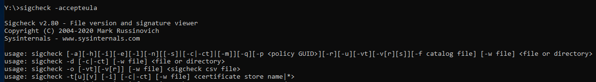
Use Case: Check for unsigned files in C:\Windows\System32.

Command: sigcheck -u -e C:\Windows\System32
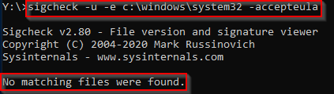
Parameter usage:
- 
- -u "If VirusTotal check is enabled, show files that are unknown by VirusTotal or have non-zero detection, otherwise show only unsigned files."
- -e "Scan executable images only (regardless of their extension)"

## Streams

"The NTFS file system provides applications the ability to create alternate data streams of information. By default, all data is stored in a file's main unnamed data stream, but by using the syntax 'file:stream', you are able to read and write to alternates." (official definition)

Alternate Data Streams (ADS) is a file attribute specific to Windows NTFS (New Technology File System). Every file has at least one data stream ($DATA) and ADS allows files to contain more than one stream of data. Natively Window Explorer doesn't display ADS to the user. There are 3rd party executables that can be used to view this data, but Powershell gives you the ability to view ADS for files.

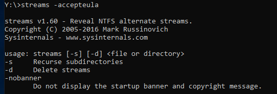

## SDelete

"SDelete is a command line utility that takes a number of options. In any given use, it allows you to delete one or more files and/or directories, or to cleanse the free space on a logical disk."
SDelete has been used by adversaries and is associated with MITRE techniques T1485 (Data Destruction) and T1070.004 (Indicator Removal on Host: File Deletion). It's MITRE ID S0195.

## TCPView

"TCPView is a Windows program that will show you detailed listings of all TCP and UDP endpoints on your system, including the local and remote addresses and state of TCP connections. On Windows Server 2008, Vista, and XP, TCPView also reports the name of the process that owns the endpoint. TCPView provides a more informative and conveniently presented subset of the Netstat program that ships with Windows. The TCPView download includes Tcpvcon, a command-line version with the same functionality." 

the below picture shows the default view of the TCPVIEW

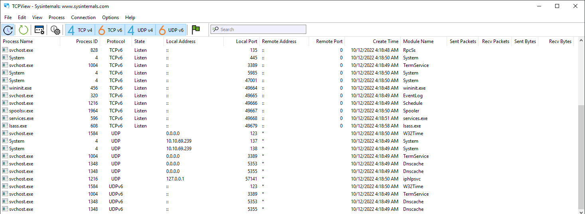

We can apply additional filtering by turning off TCP v4, TCP v6, UDP v4, and UDP v6 at the top toolbar, depending on which protocols we want to display. Moreover, we can click on the green flag to use the States Filter.(which can be seen the picture above)

Clicking the green flag opens the States Filter, which provides an extensive list of options to select which connection states we want to display. Most of the connection states available apply only to TCP connections. 

## Autoruns

"This utility, which has the most comprehensive knowledge of auto-starting locations of any startup monitor, shows you what programs are configured to run during system bootup or login, and when you start various built-in Windows applications like Internet Explorer, Explorer and media players. These programs and drivers include ones in your startup folder, Run, RunOnce, and other Registry keys. Autoruns reports Explorer shell extensions, toolbars, browser helper objects, Winlogon notifications, auto-start services, and much more. Autoruns goes way beyond other autostart utilities." (official definition)

Note: This is a good tool to search for any malicious entries created in the local machine to establish Persistence.

Below is a snapshot of Autoruns, showing the first couple of items from the Everything tab. Normally there are a lot of entries within this tab.

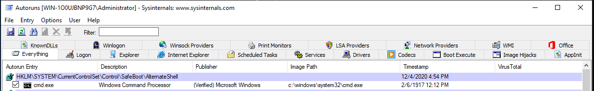

## ProcDump

"ProcDump is a command-line utility whose primary purpose is monitoring an application for CPU spikes and generating crash dumps during a spike that an administrator or developer can use to determine the cause of the spike." (official definition)

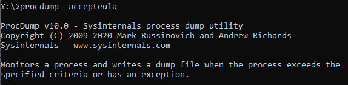

## Process Explorer

"The Process Explorer display consists of two sub-windows. The top window always shows a list of the currently active processes, including the names of their owning accounts, whereas the information displayed in the bottom window depends on the mode that Process Explorer is in: if it is in handle mode you'll see the handles that the process selected in the top window has opened; if Process Explorer is in DLL mode you'll see the DLLs and memory-mapped files that the process has loaded." (official definition)

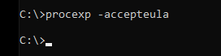

this almost as good as discused topic it,it has easy to use UI and the basic knowledge to understand it was previously discused in previous file . 

# Process Monitor

"Process Monitor is an advanced monitoring tool for Windows that shows real-time file system, Registry and process/thread activity. It combines the features of two legacy Sysinternals utilities, Filemon and Regmon, and adds an extensive list of enhancements including rich and non-destructive filtering, comprehensive event properties such as session IDs and user names, reliable process information, full thread stacks with integrated symbol support for each operation, simultaneous logging to a file, and much more. Its uniquely powerful features will make Process Monitor a core utility in your system troubleshooting and malware hunting toolkit." (official definition)

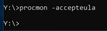

In the below snapshot, I set a filter to capture all the events related to PID 3888, notepad.exe. You can see some of the file operations that were captured and the file path or registry path/key the action occurred on, and the operation result.
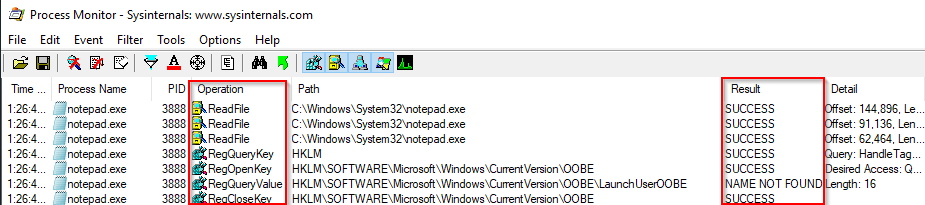

## PsExec

"PsExec is a light-weight telnet-replacement that lets you execute processes on other systems, complete with full interactivity for console applications, without having to manually install client software. PsExec's most powerful uses include launching interactive command-prompts on remote systems and remote-enabling tools like IpConfig that otherwise do not have the ability to show information about remote systems." (official definition)

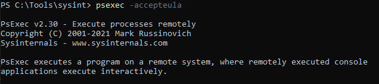

## Sysmon

"System Monitor (Sysmon) is a Windows system service and device driver that, once installed on a system, remains resident across system reboots to monitor and log system activity to the Windows event log. It provides detailed information about process creations, network connections, and changes to file creation time. By collecting the events it generates using Windows Event Collection or SIEM agents and subsequently analyzing them, you can identify malicious or anomalous activity and understand how intruders and malware operate on your network." (official definition)

## WinObj

"WinObj is a 32-bit Windows NT program that uses the native Windows NT API (provided by NTDLL.DLL) to access and display information on the NT Object Manager's name space." (official definition)

The below image shows the default view for WinObj.
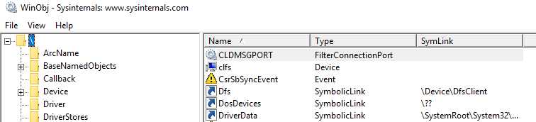

## BgInfo

"It automatically displays relevant information about a Windows computer on the desktop's background, such as the computer name, IP address, service pack version, and more." (official definition)

This is a handy utility if you manage multiple machines. This tool, or similar tools, are typically utilized on servers. When a user RDPs into a server, the system information is displayed on the wallpaper to provide quick information about the server, such as the server's name.

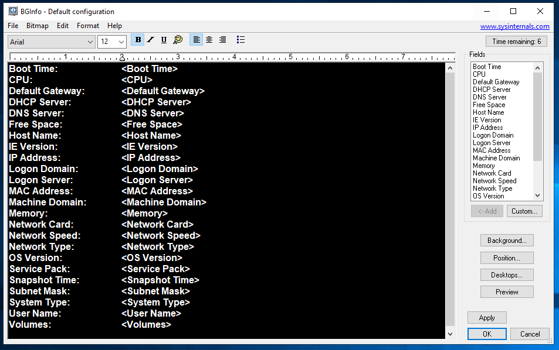

# RegJump

"This little command-line applet takes a registry path and makes Regedit open to that path. It accepts root keys in standard (e.g. HKEY_LOCAL_MACHINE) and abbreviated form (e.g. HKLM)." (official definition)

When navigating through the registry using the Registry Editor, one must manually drill down to the key you wish to inspect.

There are multiple ways to query the Windows Registry without using the Registry Editor, such as via the command line (reg query) and PowerShell (Get-Item/Get-ItemProperty).

Using Regjump will open the Registry Editor and automatically open the editor directly at the path, so one doesn't need to navigate it manually.
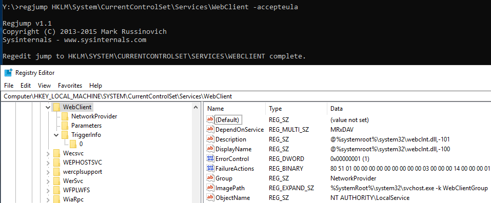

Strings

"Strings just scans the file you pass it for UNICODE (or ASCII) strings of a default length of 3 or more UNICODE (or ASCII) characters. Note that it works under Windows 95 as well." (official definition)

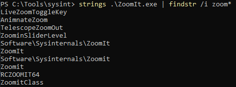