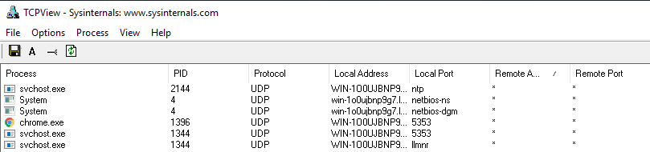

# end point security intro
## sysinternals 
sysinternals is the cluster of miltilpe tools which is used over the multiple domains like :-
- File and Disk Utilities
- Networking Utilities
- Process Utilities
- Security Utilities
- System Information
- Miscellaneous
  
**and the most used among them are :-**
- TCPView - Networking Utility tool.
- Process Explorer - Process Utility tool.
## TCPVIEW
TCPView is a Windows program that will show you detailed listings of all TCP and UDP endpoints on your system, including the local and remote addresses and state of TCP connection
on some software like Windows Server 2008, Vista, and XP tcpview reports the process that owns end points 
tcpview is know for the more infromative and convinently presented subset of the netstat program that ships with windows 

*note :- the tcpview comes with cli version of it known as tcpvcon


source:tryhackme
As shown above, every connection initiated by a process is listed by the tool, which may aid in correlating the network events executed concurrently.

## **PROCESS EXPLORER**
the process explorer comes with the two windows the top one shows
1. the process running
2. the accounts owning that proceeses

the bottom window shows the active mode of the process explorer
****

# 	ENDPOINT LOGGING AND MONITORING
endpoint logging, enables us to audit significant events across different endpoints, collect and aggregate them for searching capabilities, and better automate the detection of anomalies.
## windows event log
the windows event log are not the regular files that can be viewed in the text editor , they are stored in the propriatery binary software with .ent or .evtx extension and they are typically stored in the 
`C:\Windows\System32\winevt\Logs`
the three ways to view logs are :-
1. Event Viewer (GUI-based application)
2. Wevtutil.exe (command-line tool)
3. Get-WinEvent (PowerShell cmdlet)
## sysmon
Sysmon (stands for system monitor) , a tool used to monitor and log events on Windows, is commonly used by enterprises as part of their monitoring and logging solutions. As part of the Windows Sysinternals package, Sysmon is similar to Windows Event Logs with further detail and granular control.

it is commonly used with a security information and event management (SIEM) system or other log parsing solutions that aggregate, filter, and visualize events. 
Lastly, Sysmon includes 27 types of Event IDs, all of which can be used within the required configuration file to specify how the events should be handled and analyzed. 
An excellent example of a configuration file auditing different Event IDs created by SwiftOnSecurity is linked here [](https://github.com/SwiftOnSecurity/sysmon-config)

## OSQUERY
Osquery is an open-source tool created by Facebook. With Osquery, Security Analysts, Incident Responders, and Threat Hunters can query an endpoint (or multiple endpoints) using SQL syntax. Osquery can be installed on various platforms: Windows, Linux, macOS, and FreeBSD.

To interact with the Osquery interactive console/shell, open CMD (or PowerShell) and run osqueryi. You'll know that you've successfully entered into the interactive shell by the new command prompt.
buy using the software Kolide Fleet  use can filter the multiple end points at the same time .
```
osquery> select pid,name,path from processes where name='lsass.exe';
+-----+-----------+-------------------------------+
| pid | name      | path                          |
+-----+-----------+-------------------------------+
| 748 | lsass.exe | C:\Windows\System32\lsass.exe |
+-----+-----------+-------------------------------+
osquery> 
```

## WAZUH 
Wazuh is an open-source, freely available, and extensive EDR (endpoint detection response ) solution, which Security Engineers can deploy in all scales of environments.
wazuh operater on managment agent model it magment is installed on the single device and the agent is installed on the devices you would like to monitor

let's briefly run through what an EDR is. Endpoint detection and response (EDR) are tools and applications that monitor devices for an activity that could indicate a threat or security breach. These tools and applications have features that include:

- Auditing a device for common vulnerabilities
- Proactively monitoring a device for suspicious activity such as unauthorized logins, brute-force attacks, or privilege escalations.
- Visualizing complex data and events into neat and trendy graphs
- Recording a device's normal operating behaviour to help with detecting anomalies

## BASELINING

Baselining is the process of knowing what is expected to be normal. In terms of endpoint security monitoring,
****
****
# core windows processes
to detect what is abnormal you need to know waht is normal . so,to today we are gonna see what are the normal processes in the windows .

today's antivirus is just a defensive mechanism in devices but they cant detect every malware . then the is the need of softwares like EDR , to protect our systems from the malware .

But guess what even the they are ways to bypass this ,that is where professionals come in .

there are the utility of windows and it's processes that you should know to create a baseline and then deferenciate what is the normal and what is abnormal in it.
## TASK MANAGER 
Task Manager is a built-in GUI-based Windows utility that allows users to see what is running on the Windows system. It also provides information on resource usage, such as how much each process utilizes CPU and memory. When a program is not responding, Task Manager is used to end (kill) the process. 
you can open task manger thought start menu or by using the short cut *crtl+shift+esc*
if you are the windows user even if you user it casually you might be familiar with the interface which it easy to navigate . 
the default tab when you open is the processes tab which is futher divide into the apps and the background task. Name, Status, CPU, and Memory these are the default coloums but you can add the extra columns my right clicking on the colums available 

source : tryhackme
The view looks a little better. Let's briefly go over each column (excluding Name, of course): 

- Type - Each process falls into 1 of 3 categories (Apps, Background process, or Windows process).
- Publisher - Think of this column as the name of the author of the program/file.
- PID - This is known as the process identifier number. Windows assigns a unique process identifier each time a program starts. If the same program has multiple running processes, each will have its unique process identifier (PID).
- Process name - This is the file name of the process. In the above image, the file name for Task Manager is Taskmrg.exe. 
- Command line - The full command used to launch the process. 
- CPU - The amount of CPU (processing power) the process uses.
- Memory - The amount of physical working memory utilized by the process.

Let's move to the Details tab. This view provides some core processes that will be discussed in this room. Sort the PID column so that the PIDs are in ascending order.

Add some additional columns to see more information about these processes. Good columns to add are Image path name and Command line.


Task Manager is a powerful built-in Windows utility but lacks certain important information when analyzing processes, such as parent process information. It is another key column when identifying outliers. Back to svchost.exe, if the parent process for PID 384 is not services.exe, this will warrant further analysis

Task Manager doesn't show a Parent-Child process view. That is where other utilities, such as Process Hacker and Process Explorer, come to the rescue.

## SYSTEM
**The System process (process ID 4) is the home for a special kind of thread that runs only in kernel mode a kernel-mode system thread. System threads have all the attributes and contexts of regular user-mode threads (such as a hardware context, priority, and so on) but are different in that they run only in kernel-mode executing code loaded in system space, whether that is in Ntoskrnl.exe or in any other loaded device driver. In addition, system threads don't have a user process address space and hence must allocate any dynamic storage from operating system memory heaps, such as a paged or nonpaged pool**
source:- windows 


source:- tryhackme 
What is unusual behaviour for this process?
1. A parent process (aside from System Idle Process (0))
2. Multiple instances of System. (Should only be one instance) 
3. A different PID. (Remember that the PID will always be PID 4)
4. Not running in Session 0
## SYSTEM>SMSS.EXE
The next process is smss.exe (Session Manager Subsystem). This process, also known as the Windows Session Manager, is responsible for creating new sessions. It is the first user-mode process started by the kernel.
Smss.exe starts csrss.exe (Windows subsystem) and wininit.exe in Session 0, an isolated Windows session for the operating system, and csrss.exe and winlogon.exe for Session 1, which is the user session. The first child instance creates child instances in new sessions, done by smss.exe copying itself into the new session and self-terminating

what is normal ?

Image Path:  %SystemRoot%\System32\smss.exe
Parent Process:  System
Number of Instances:  One master instance and child instance per session. The child instance exits after creating the session.
User Account:  Local System
Start Time:  Within seconds of boot time for the master instance

What is unusual?
- A different parent process other than System (4)
- The image path is different from C:\Windows\System32
- More than one running process. (children self-terminate and exit after each new session)
- The running User is not the SYSTEM user
- Unexpected registry entries for Subsystem
## CSRSS.EXE
srss.exe (Client Server Runtime Process) is the user-mode side of the Windows subsystem. This process is always running and is critical to system operation. If this process is terminated by chance, it will result in system failure. This process is responsible for the Win32 console window and process thread creation and deletion.

This process is also responsible for making the Windows API available to other processes, mapping drive letters, and handling the Windows shutdown process
what is normal ?
session 0(pid 392)

Session 1 (PID 512)

Image Path:  %SystemRoot%\System32\csrss.exe
Parent Process:  Created by an instance of smss.exe
Number of Instances:  Two or more
User Account:  Local System
Start Time:  Within seconds of boot time for the first two instances (for Session 0 and 1). Start times for additional instances occur as new sessions are created, although only Sessions 0 and 1 are often created.

What is unusual?
- An actual parent process. (smss.exe calls this process and self-terminates)
- Image file path other than C:\Windows\System32
- Subtle misspellings to hide rogue processes masquerading as csrss.exe in plain sight
- The user is not the SYSTEM user.
## WININIT.EXE
The Windows Initialization Process, wininit.exe, is responsible for launching services.exe (Service Control Manager), lsass.exe (Local Security Authority), and lsaiso.exe within Session 0. It is another critical Windows process that runs in the background, along with its child processes. 

Wininit.exe process tree.


Note: lsaiso.exe is a process associated with Credential Guard and KeyGuard. You will only see this process if Credential Guard is enabled. 

What is normal?


Wininit.exe properties.

Image Path:  %SystemRoot%\System32\wininit.exe
Parent Process:  Created by an instance of smss.exe
Number of Instances:  One
User Account:  Local System
Start Time:  Within seconds of boot time

What is unusual?
An actual parent process. (smss.exe calls this process and self-terminates)
Image file path other than C:\Windows\System32
Subtle misspellings to hide rogue processes in plain sight
Multiple running instances
Not running as SYSTEM
## wininit.exe > services.exe
The next process is the Service Control Manager (SCM) or services.exe. Its primary responsibility is to handle system services: loading services, interacting with services and starting or ending services. It maintains a database that can be queried using a Windows built-in utility, sc.exe
This process also loads device drivers marked as auto-start into memory. 

This process is the parent to several other key processes: svchost.exe, spoolsv.exe, msmpeng.exe, and dllhost.exe, to name a few.
What is normal?


Image Path:  %SystemRoot%\System32\services.exe
Parent Process:  wininit.exe
Number of Instances:  One
User Account:  Local System
Start Time:  Within seconds of boot time

What is unusual?
- A parent process other than wininit.exe
- Image file path other than C:\Windows\System32
- Subtle misspellings to hide rogue processes in plain sight
- Multiple running instances
- Not running as SYSTEM

## wininit.exe > services.exe > svchost.exe
The Service Host (Host Process for Windows Services), or svchost.exe, is responsible for hosting and managing Windows services. 

The services running in this process are implemented as DLLs. The DLL to implement is stored in the registry for the service under the Parameters subkey in ServiceDLL. The full path is HKLM\SYSTEM\CurrentControlSet\Services\SERVICE NAME\Parameters.

What is normal?


Image Path: %SystemRoot%\System32\svchost.exe
Parent Process: services.exe
Number of Instances: Many
User Account: Varies (SYSTEM, Network Service, Local Service) depending on the svchost.exe instance. In Windows 10, some instances run as the logged-in user.
Start Time: Typically within seconds of boot time. Other instances of svchost.exe can be started after boot.

What is unusual?
- A parent process other than services.exe
- Image file path other than C:\Windows\System32
- Subtle misspellings to hide rogue processes in plain sight
- The absence of the -k parameter
## lsass.exe
Per Wikipedia, "Local Security Authority Subsystem Service (LSASS) is a process in Microsoft Windows operating systems that is responsible for enforcing the security policy on the system. It verifies users logging on to a Windows computer or server, handles password changes, and creates access tokens. It also writes to the Windows Security Log."

It creates security tokens for SAM (Security Account Manager), AD (Active Directory), and NETLOGON. It uses authentication packages specified in `HKLM\System\CurrentControlSet\Control\Lsa.`

What is normal?


Image Path:  %SystemRoot%\System32\lsass.exe
Parent Process:  wininit.exe
Number of Instances:  One
User Account:  Local System
Start Time:  Within seconds of boot time

What is unusual?
- A parent process other than wininit.exe
- Image file path other than C:\Windows\System32
- Subtle misspellings to hide rogue processes in plain sight
- Multiple running instances
- Not running as SYSTEM

## winlogon.exe
The Windows Logon, winlogon.exe, is responsible for handling the Secure Attention Sequence (SAS). It is the ALT+CTRL+DELETE key combination users press to enter their username & password. 

This process is also responsible for loading the user profile. It loads the user's NTUSER.DAT into HKCU, and userinit.exe loads the user's shell
What is normal?

Image Path:  %SystemRoot%\System32\winlogon.exe
Parent Process:  Created by an instance of smss.exe that exits, so analysis tools usually do not provide the parent process name.
Number of Instances:  One or more
User Account:  Local System
Start Time:  Within seconds of boot time for the first instance (for Session 1). Additional instances occur as new sessions are created, typically through Remote Desktop or Fast User Switching logons.


What is unusual?
- An actual parent process. (smss.exe calls this process and self-terminates)
- Image file path other than C:\Windows\System32
- Subtle misspellings to hide rogue processes in plain sight
- Not running as SYSTEM
- Shell value in the registry other than explorer.exe
## explorer.exe
The last process we'll look at is Windows Explorer, explorer.exe. This process gives the user access to their folders and files. It also provides functionality for other features, such as the Start Menu and Taskbar.

As mentioned previously, the Winlogon process runs userinit.exe, which launches the value in HKLM\Software\Microsoft\Windows NT\CurrentVersion\Winlogon\Shell. Userinit.exe exits after spawning explorer.exe. Because of this, the parent process is non-existent. 
What is normal?


Image Path:  %SystemRoot%\explorer.exe
Parent Process:  Created by userinit.exe and exits
Number of Instances:  One or more per interactively logged-in user
User Account:  Logged-in user(s)
Start Time:  First instance when the first interactive user logon session begins

What is unusual?
An actual parent process. (userinit.exe calls this process and exits)
Image file path other than C:\Windows
Running as an unknown user
Subtle misspellings to hide rogue processes in plain sight
Outbound TCP/IP connections
****
***


